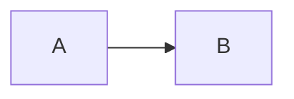

# Markdown

YAML frontmatter (required)
```
---
title: "My Title"
date: 2025-08-22
tags: [tag1, tag2]
status: draft
---
```

- Use frontmatter keys: `title`, `date`, `tags`, `status`.
- Enforce style: `markdownlint -f`.
- Use Mermaid for diagrams where helpful:


Quick checklist
- Frontmatter present? ✅
- Linted? `markdownlint -f` ✅
- Diagrams in Mermaid if needed ✅
